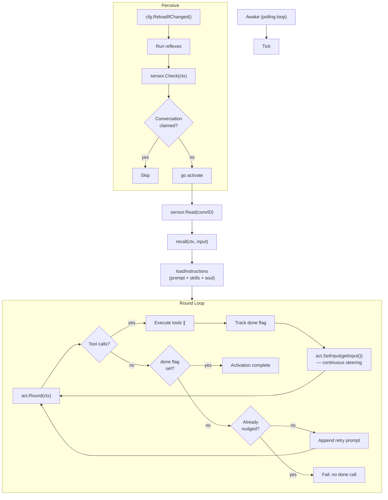
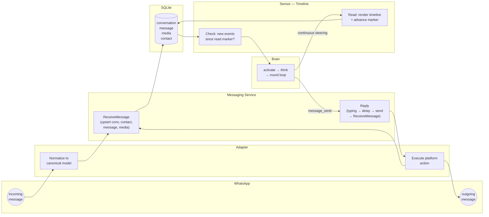

# Nik

Nik (Noetic Intelligence Kernel) is an autonomous personal AI that lives on WhatsApp. Not an assistant -- a family member. It has its own phone number, its own personality, and genuine relationships with the people it talks to. Built in Go, backed by SQLite, powered by LLMs.

## Philosophy

- **Highest autonomy** -- nik runs on its own. No human in the loop, no babysitting.
- **Smallest codebase** -- small enough for one person (or one AI) to fully grok. Every line earns its place.
- **Core tools + extensible skills** -- a small set of powerful built-in tools and a growing set of user-defined skills that compose them.

## The Brain Loop

The brain is a polling loop. Every 2 seconds it checks for new events and handles them.

```
Awake(ctx, 2s)
│
├─ perceive
│   ├─ cfg.ReloadIfChanged()
│   ├─ run reflexes (fire alarms, check stale tasks, reap shells, ...)
│   ├─ sensor.Check(ctx) → []Stimulus
│   │
│   └─ for each stimulus
│       ├─ skip if conversation already claimed (dedup)
│       └─ go activate(ctx, stimulus)
│           └─ think(ctx, getInput)
│               ├─ getInput() → sensor.Read(convID) → rendered timeline
│               ├─ recall(ctx, input) → relevant memories
│               ├─ loadInstructions(now, recall)
│               ├─ llm.NewActivation(instructions, tools)
│               │
│               └─ round loop
│                   ├─ act.Round(ctx) → RoundResult
│                   ├─ transient error? → retry (up to 3)
│                   ├─ no tool calls? → done flag set? exit : nudge once, then fail
│                   ├─ loop detected (4 identical rounds)? → fail
│                   ├─ execute tools (parallel)
│                   ├─ done called? → set flag
│                   ├─ act.Prune() → trim old tool pairs if context too large
│                   └─ act.SetInput(getInput()) → re-read timeline (continuous steering)
│
└─ (repeat every 2s until ctx cancelled)
```

Every tick, the brain reloads config, runs all reflexes, then asks the sensor for new stimuli. The sensor (`Timeline`) checks each allowed conversation for events newer than the read marker. For each stimulus, the brain claims the conversation (preventing concurrent activations) and spawns a goroutine.

Inside the goroutine, `think` reads the timeline, runs recall (LLM-filtered memories), loads instructions (base prompt + identity + conversation rules + skills + brain waves + soul), and enters the round loop. Each round calls the LLM, executes any tool calls in parallel, then re-reads the timeline so the model sees its own side effects. The loop ends when the model calls `done`.

One activation = one conversation. The model does all its work -- perceiving, planning, acting -- in a single burst of rounds. When `done` is called, it's over.



## Sense and Reflexes

The brain has one sensor and many reflexes. The sensor is the single perception interface -- it checks for new events and renders the timeline. Reflexes are mechanical side-effect functions that run every tick (some are throttled) to materialize facts the sensor will later observe.

```go
type Sensor interface {
    Check(ctx context.Context) ([]Stimulus, error)
    Read(ctx context.Context, convID string) string
}

type Reflex func(ctx context.Context)
```

The sensor is `Timeline` (`internal/timeline/`). It iterates allowed conversation IDs, queries messages, and compares timestamps against the read marker. `Read` renders the full conversation as a markdown timeline with "Old messages" and "New messages" sections split at the read line, then advances the marker.

Reflexes create the conditions the sensor detects:

| Reflex | Package | Throttle | What it does |
|--------|---------|----------|--------------|
| `FireDueAlarms` | alarms | every tick | creates alarm occurrences (system messages) when `next_fire_at` has passed |
| `CheckStale` | task | every tick | inserts stale reports for tasks with no recent activity |
| `StaleAlarmReflex` | alarms | 30 min | detects recurring alarms with null/past `next_fire_at` |
| `SkillChangeReflex` | skills | 5 min | detects skill file additions, removals, content changes |
| `CheckSessions` | shell | 10 sec | reaps dead/stale tmux sessions |

## Messaging: Adapters and the Canonical Model

Messaging is split into two layers:

**Canonical layer** -- platform-agnostic tables (`conversation`, `message`, `media`, `contact`) are the source of truth. Every message nik sends or receives lives here with a UUIDv7 primary key, regardless of where it came from.

**Adapter layer** -- each platform implements `MessagingPlatform`: normalize inbound events into canonical models, execute outbound actions (reply, react, send media, typing indicators, read receipts). Currently there's one adapter: WhatsApp via whatsmeow.

The two interfaces that connect them:

```go
// inbound -- adapters push events through this
type MessageReceiver interface {
    ReceiveConversation(ctx, conv) error
    ReceiveMessage(ctx, msg) error
    OnHistorySyncComplete(ctx, platform) error
}

// outbound -- brain tools call these via the service
type MessagingPlatform interface {
    Platform() string
    Start(ctx, receiver) error
    Stop(ctx) error
    Reply(ctx, externalConversationID, body, quote) (OutboundMessage, error)
    SendImage(ctx, externalConversationID, imagePath, caption) (OutboundMessage, error)
    SendAudio(ctx, externalConversationID, audioPath, voiceNote) (OutboundMessage, error)
    React(ctx, externalConversationID, externalMessageID, externalSenderID, emoji) (OutboundMessage, error)
    SetPresence(ctx, available) error
    StartTyping / StopTyping(ctx, externalConversationID) error
    MarkRead(ctx, refs) error
}
```



When a message arrives: the WhatsApp adapter normalizes it and calls `ReceiveMessage`, which upserts the conversation, resolves/creates the contact, and inserts the message. On the next tick, the sensor's `Check` finds events newer than the read marker and returns a stimulus. The brain activates and calls `Read` to render the timeline. Each round of the think loop re-reads the timeline (continuous steering), so the model sees its own side effects in real time. When the model calls `message_send`, the service types, delays, sends via the adapter, and feeds the outbound message back through `ReceiveMessage` so it appears in the canonical history.

## Autonomous Systems

These run on schedule via alarms. The `FireDueAlarms` reflex creates alarm occurrence messages when `next_fire_at` has passed. The timeline sensor sees these as new events, triggers an activation, and the model loads the relevant skill. Core alarms use `[NIK_XXX]` goal prefixes (e.g. `[NIK_JOURNAL]`, `[NIK_DREAM_1]`). Skills document the alarm format and install them on first load.

- **Journal**: managed by the `journal` skill. Recurring alarm, gathers day context via `db_query`/`shell`, writes to `journal/` files. No domain package.
- **Dream**: managed by the `dream` skill. Multiple recurring alarms (one per dream pass), processes journal and memories, writes to `dreams/` files. The final pass (Wake) evolves nik's **soul** — a living identity document stored in `soul/latest.md` and loaded into the system prompt on every activation. Dated snapshots in `soul/YYYY-MM-DD.md` preserve history. No domain package.
- **Briefing**: managed by the `briefing` skill. Recurring alarm, searches the web for news (via the `web` skill), writes to `briefings/` files. No domain package.
- **Diagnostic**: managed by the `diagnostic` skill. Recurring alarm, discovers skills/services, tests auth, verifies alarm chains and skill outputs, checks data integrity and spending. Writes to `diagnostics/` files. No domain package.

## Tasks and the Timeline

**Principle:** when things happen, they appear in the timeline. If making an event appear is hard, the data model is wrong.

**Notification model:** the timeline is a notification feed. Task and alarm entries use structured key: value format with 11-space padding on continuation lines (width of `[HH:MM:SS] `). Report content is truncated to 200 chars with `[truncated]` marker. `task_status` provides the full picture: plan, complete report content, tool calls, retry chain.

**Two actors:**

- Workers produce `task_report` rows with a `status` field (`running`, `completed`, `failed`). The runner reads the last report's status to set `task.status`.
- The system produces lifecycle entries from the `task` table (spawned, cancelled, retried).

| Event        | Who produces it                    | Timeline entry                        | Separate system entry?               |
| ------------ | ---------------------------------- | ------------------------------------- | ------------------------------------ |
| Task created | nik calls `task_spawn`             | `[Task spawned]`                      | Yes — introduces the task_id         |
| Progress     | worker writes report               | `[Task report] ... status: running`   | No                                   |
| Completed    | worker writes final report         | `[Task report] ... status: completed` | No — the report IS the event         |
| Failed       | worker writes final report         | `[Task report] ... status: failed`    | No — the report IS the event         |
| Cancelled    | nik calls `task_cancel`            | `[Task cancelled]`                    | Yes — no report covers this          |
| Retried      | nik calls `task_retry`             | `[Task retry #N spawned]`             | Yes — introduces the new task_id     |
| Stale        | `CheckStale` reflex inserts report | `[Task report] ... stale`             | No — stale detection writes a report |

`task_status` is for drill-down, not discovery.

## Tools

Domain packages define tools via `BuildTools()` and register them in `main.go`. The brain makes them available to the LLM during activations. Some tools are privileged (owner-only). Workers get a subset.

| Package | Tools |
|---------|-------|
| **messaging** | `message_send`, `message_react`, `message_set_presence` |
| **shell** | `shell`, `shell-rebuild`, `shell-factory-reset` |
| **alarms** | `alarm`, `update_alarm`, `cancel_alarm` |
| **contacts** | `update_contact` |
| **db** | `db_query` |
| **llm** | `describe_media` |
| **fs** | `read_file`, `write_file` |
| **skills** | `load_skill` |
| **config** | `config` |
| **task** | `task_spawn`, `task_status`, `task_list`, `task_cancel`, `task_report`, `task_retry` |

Skills extend nik's capabilities at runtime. Loading a skill (via `load_skill`) injects domain knowledge and instructions into the activation -- the LLM then uses built-in tools to execute. For example, the `web` skill teaches nik to search with Exa and fetch URLs via `shell`, the `journal` skill teaches it to gather day context and `write_file` entries.
