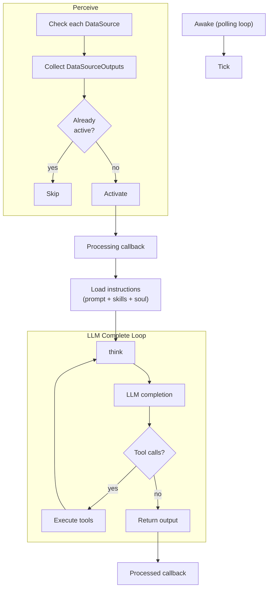
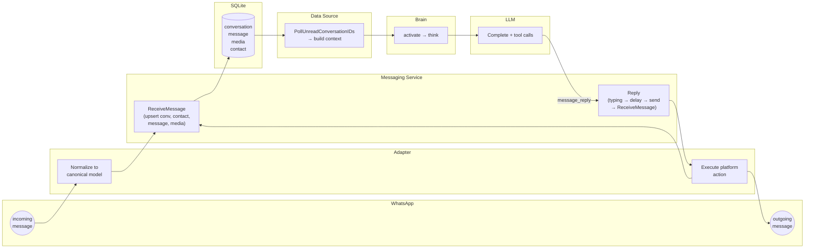

# Nik

Nik (Noetic Intelligence Kernel) is an autonomous personal AI that lives on WhatsApp. Not an assistant -- a family member. It has its own phone number, its own personality, real long-term memory, and genuine relationships with the people it talks to. Built in Go, backed by SQLite, powered by LLMs.

## Philosophy

- **Highest autonomy** -- nik runs on its own. No human in the loop, no babysitting.
- **Smallest codebase** -- small enough for one person (or one AI) to fully grok. Every line earns its place.
- **Core tools + extensible skills** -- a small set of powerful built-in tools and a growing set of user-defined skills that compose them.

## The Brain Loop

The brain is the core of the system. It's a polling loop that checks for things to do and handles them.

```
Awake(ctx, 2s)
│
├─ perceive
│   ├─ for each DataSource → Check(ctx)
│   │   └─ returns []DataSourceOutput (lines of context + metadata)
│   │
│   └─ for each output
│       ├─ skip if conversation already active (dedup)
│       └─ go activate(ctx, output)
│           ├─ Processing callback (e.g. mark read)
│           ├─ think
│           │   ├─ loadInstructions (prompt + skills + soul + time)
│           │   ├─ join input lines
│           │   └─ llm.Complete (loop: completion → tool calls → execute → repeat)
│           └─ Processed callback (e.g. mark alarm fired)
│
└─ (repeat every 2s until ctx cancelled)
```

Every 2 seconds the brain calls `Check()` on each registered data source. Each source returns zero or more outputs -- chunks of context with metadata like `conversation_id`. For each output, the brain spawns a goroutine (an activation): it loads the system prompt (personality + preloaded skills + soul), concatenates the input, and thinks -- which under the hood means calling `llm.Complete`. The LLM can make tool calls (reply, search memory, set alarms, run shell commands), and each result feeds back into the completion loop until the model is done.

One activation = one shot. There are no follow-up turns. When the model returns, it's over. This constraint forces the model to do all its work -- searching, thinking, replying -- in a single burst.



## Data Sources

A data source is anything that can produce work for the brain. Each one implements a single method: `Check(ctx) ([]DataSourceOutput, error)`. The brain doesn't know or care what generates the inputs -- it just polls.

| Source | Trigger | What it produces |
|--------|---------|------------------|
| **messaging** | unread conversations in the allow list | conversation history + session context + new messages |
| **alarms** | a reminder's `fire_at` has passed | the alarm goal + conversation context |
| **shell** | a tmux session exited or hit its check-in time | session output for review |
| **journal** | end of day (configurable time) | the day's conversations and memories for reflection |
| **dream** | nightly passes (1-4 hourly after journal) | prior dreams + memories for subconscious processing |
| **briefing** | morning after wake | daily briefing context |

Each output carries metadata (`conversation_id`, `message_id`, etc.) and optional lifecycle callbacks (`Processing` runs before the LLM, `Processed` runs after).

## Messaging: Adapters and the Canonical Model

Messaging is split into two layers:

**Canonical layer** -- platform-agnostic tables (`conversation`, `message`, `media`, `contact`) are the source of truth. Every message nik sends or receives lives here with a UUIDv7 primary key, regardless of where it came from.

**Adapter layer** -- each platform implements `MessagingPlatform`: normalize inbound events into canonical models, execute outbound actions (reply, react, typing indicators, read receipts). Currently there's one adapter: WhatsApp via whatsmeow.

The two interfaces that connect them:

```go
// inbound -- adapters push events through this
type MessageReceiver interface {
    ReceiveConversation(ctx, conv)
    ReceiveMessage(ctx, msg)
    OnHistorySyncComplete(ctx, platform)
}

// outbound -- brain tools call these via the service
type MessagingPlatform interface {
    Reply(ctx, externalConversationID, body)
    React(ctx, externalConversationID, externalMessageID, emoji)
    StartTyping / StopTyping / SetPresence / MarkRead
}
```

The full flow of a message through the system:



When a message arrives: the WhatsApp adapter normalizes it and calls `ReceiveMessage`, which upserts the conversation, resolves/creates the contact, and inserts the message. On the next perceive cycle, the messaging data source polls for unread conversations, builds the context (history + session info + participant profiles), and hands it to the brain. The brain activates, thinks, and calls tools -- most commonly `message_reply`, which goes back through the service to the adapter and out to WhatsApp. The outbound message is also fed back through `ReceiveMessage` so it appears in the canonical history.

## Tools

Domain packages define tools via `BuildTools()` and register them at startup. The brain makes them available to the LLM during activations. Some tools are privileged (owner-only).

**messaging** -- `message_reply`, `message_react`, `message_noop`, `message_set_presence`, `message_update_media_description`

**memory** -- `store_memory`, `search_memory`, `delete_memory`

**shell** -- `shell` (tmux: run, read, send, kill, list)

**alarms** -- `alarm`

**contacts** -- `update_contact`

**search** -- `db_query`, `search_contacts`

**llm** -- `describe_media`

**websearch** -- `web_search`

**skills** -- `load_skill`

**config** -- `update_config`

**journal** -- `journal_write`

**dream** -- `dream_write`, `soul_evolve`

**briefing** -- `briefing_write`
