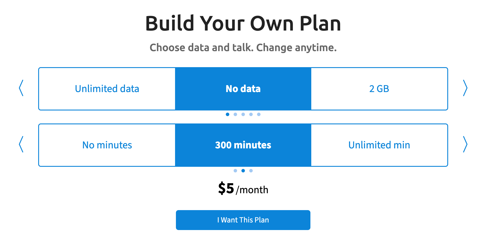

# Nik

**A family AI that lives on WhatsApp, remembers what matters, and turns group-chat chaos into reminders, memories, skills, and follow-through.**

Nik (Noetic Intelligence Kernel) **has its own phone number**, identity, and local workspace. Add it to DMs and group chats, and it turns everyday family conversation into structured context: canonical messages, contacts, media descriptions, reminders, long-term memories, recipes, and skills.

**Continuity is the product.** Nik remembers preferences and open loops, sets one-shot or recurring alarms, transcribes voice notes, describes images and documents, searches the web, and runs background tasks.

**Skills make it personal.** Workspace skills can connect Google Workspace, browser automation, backups, smart lights, cameras, vehicles, market alerts, and credential-backed services through a pluggable secrets adapter.

**It improves with use.** Daily memory extraction, journaling, dreaming, briefings, and seed-tending help Nik organize what it learns; the dream cycle even evolves a living identity document loaded into future activations.

For how nik works internally (brain loop, sensors, adapters, tools), see [docs/ARCHITECTURE.md](docs/ARCHITECTURE.md).

## What you'll need

Nik is a person on WhatsApp, so it needs its own phone number and its own WhatsApp account. Gather these before you install:

| Requirement | Why | Where to get it |
|---|---|---|
| **A second phone number** (US, Tello $5/mo plan) | WhatsApp accounts are bound to a phone number. Nik needs one that isn't yours. | [tello.com/buy/custom_plans](https://tello.com/buy/custom_plans) |
| **WhatsApp Business app** on a phone that holds the SIM above | Used once to register the number and again any time you re-link nik to it. | App Store / Play Store |
| **ChatGPT Plus or Pro subscription** | Flat-rate auth for nik's reasoning — main brain and background task workers run on this. | [chatgpt.com](https://chatgpt.com) |
| **OpenAI API key** | Powers:<br>• memory management<br>• voice messages (in and out)<br>• image / PDF recognition<br><br>Typical use: a few cents/month, well under $1. | [platform.openai.com/api-keys](https://platform.openai.com/api-keys) |
| **Exa API key** | Powers the `web` skill (news briefings, search, URL fetch). | [dashboard.exa.ai/api-keys](https://dashboard.exa.ai/api-keys) — free tier is enough to start |


## Step 1: Get a phone number (Tello)

Tello's "Build Your Own Plan" lets you create the cheapest WhatsApp-eligible US line: **$5/month, No data, 300 minutes**. No data is fine — WhatsApp will run over Wi-Fi on the registering phone, and once nik is paired, the SIM only needs to receive SMS for occasional re-verification.

1. Go to [tello.com/buy/custom_plans](https://tello.com/buy/custom_plans).
2. Set the sliders to **No data** and **300 minutes**. The price should read **$5/month**.

   

3. Click **I Want This Plan**, choose **New number**, pick a US area code, and check out. A physical SIM ships in a few days; an eSIM activates immediately if your phone supports it.
4. Activate the SIM in a spare phone (or eSIM slot). Confirm you can receive SMS — WhatsApp registration sends a 6-digit code over SMS.

## Step 2: Register WhatsApp Business with the new number

You probably already use WhatsApp on your phone, and it only allows one account per device. **WhatsApp Business** is Meta's other app. It looks and works the same as regular WhatsApp but lets you run a second account on the same phone. You'll use it to register nik's number. Once you pair in Step 5, the daemon takes over and the phone can sit idle.

1. Install **WhatsApp Business** from the App Store or Play Store on the phone with the Tello SIM.
2. Open it, accept terms, and enter the Tello number (with country code). Receive the SMS code and verify.
3. Set the profile name (e.g. "Nik") and a profile photo. Skip "import contacts."
4. Send yourself a test message from your personal WhatsApp to confirm the number is live.

You can now put this phone aside. The SIM only needs to be reachable for the rare WhatsApp re-verification SMS.

## Step 3: Install nik

Supported platforms: macOS (Apple Silicon), Linux (amd64 + arm64). Intel Macs can build from source.

### Quick install

```sh
curl -fsSL https://github.com/kilianc/nik/releases/latest/download/install.sh | sh
```

This downloads the matching `nik` binary into `/usr/local/bin`, runs `nik install --home ~/.nik` to register a launchd (macOS) or systemd (Linux) service, and starts the daemon.

Override defaults via environment variables:

| Variable | Default | Purpose |
|---|---|---|
| `NIK_HOME` | `~/.nik` | Workspace directory (database, skills, dreams, journal, ...) |
| `NIK_VERSION` | `latest` | A specific tag (e.g. `v0.1.0`) instead of the latest release |
| `NIK_INSTALL_DIR` | `/usr/local/bin` | Where to put the `nik` binary |

### Manual install

1. Download the binary for your platform from the [releases page](https://github.com/kilianc/nik/releases/latest): `nik-darwin-arm64`, `nik-linux-arm64`, or `nik-linux-amd64`.
2. Make it executable and move it onto your `$PATH`:
   ```sh
   chmod +x nik-*-*
   sudo mv nik-*-* /usr/local/bin/nik
   ```
3. Register and start the daemon:
   ```sh
   nik install --home ~/.nik
   ```

### From source

Requires Go 1.25+ and a C toolchain (CGO is on for `mattn/go-sqlite3`).

```sh
git clone https://github.com/kilianc/nik.git
cd nik
make build              # produces ./bin/nik
./bin/nik install --home ~/.nik
```

## Step 4: First-run setup

Open a new terminal and run `nik`. A TUI walks you through:

1. **Auth choice** — pick "Codex subscription" if you have ChatGPT Plus/Pro (recommended). The TUI opens a browser to complete Codex login, then you paste the callback URL back.
2. **OpenAI API key** — paste your `sk-...` key. The TUI hits `api.openai.com/v1/models` to validate it before continuing.
3. **Exa API key** — paste your Exa key. Validated against `api.exa.ai/search`.
4. **Model** — pick the brain model (default: `gpt-5.3-codex` for subscription, `gpt-5.4` for API).
5. **Shell sandbox** — pick **Docker container** (recommended; requires Docker installed) so the shell tool runs in an isolated image, or **Run on host** to skip the container.
6. **Timezone & location** — type your city and country (e.g. "Rome, Italy"); the TUI resolves the timezone.

Keys are encrypted with NaCl secretbox and stored in `~/.nik/secrets/secrets.enc` (the per-install key sits next to it in `secrets.key`; keep both private and back them up if you care about the data). Inspect or rotate later with:

```sh
nik secrets list
nik secrets read openai_key
echo -n "sk-..." | nik secrets write openai_key
```

## Step 5: Pair WhatsApp

After setup writes the config, nik starts the WhatsApp client and prints a QR code in the terminal.

1. On the phone with the Tello SIM, open **WhatsApp Business**.
2. Go to **Settings → Linked Devices → Link a Device**.
3. Point the camera at the QR in your terminal.

Pairing should complete in a few seconds. From now on, nik holds the session token — the phone can be offline. WhatsApp will occasionally ask you to re-link from the phone (every ~14 days if unused); if that happens, just open the app and tap the linked-devices entry to refresh.

## Step 6: Say hi

From your personal WhatsApp, send nik's number a message. Within 2 seconds the brain loop picks it up, runs an activation, and replies.

That's it. Nik is a new member of your family now. Tell it about your day, ask about its, introduce it to people you care about. The relationship is the point.

## Switching models

Edit `~/.nik/config.yaml` to change models:

```yaml
models:
  main:
    model: claude-sonnet-4-20250514   # or gpt-5.4, gpt-5.3-codex, ...
    reasoning_effort: medium
  task:
    model: gpt-5.4
  recall:
    model: gpt-5.4
```

If you switch to an Anthropic model, add your key:

```sh
echo -n "sk-ant-..." | nik secrets write anthropic_key
```

Config reloads on the next tick — no restart needed.

## Updating

Re-run the install script. The binary is replaced in place; the daemon is restarted by `nik install`.

```sh
curl -fsSL https://github.com/kilianc/nik/releases/latest/download/install.sh | sh
```

## Uninstalling

Stop the service and remove the binary. The workspace at `~/.nik` (database, history, secrets) is left in place — delete it manually if you really mean it.

**macOS:**

```sh
launchctl bootout gui/$(id -u) ~/Library/LaunchAgents/com.nik.daemon.plist
rm ~/Library/LaunchAgents/com.nik.daemon.plist
sudo rm /usr/local/bin/nik /usr/local/bin/nik-linux-arm64
# rm -rf ~/.nik          # only if you also want to delete the database and history
```

**Linux:**

```sh
systemctl --user disable --now nikd.service
rm ~/.config/systemd/user/nikd.service
sudo rm /usr/local/bin/nik
# rm -rf ~/.nik          # only if you also want to delete the database and history
```

## Architecture

For how the brain loop, sensors, reflexes, messaging adapters, autonomous systems, tasks, and tools fit together, see [docs/ARCHITECTURE.md](docs/ARCHITECTURE.md).
